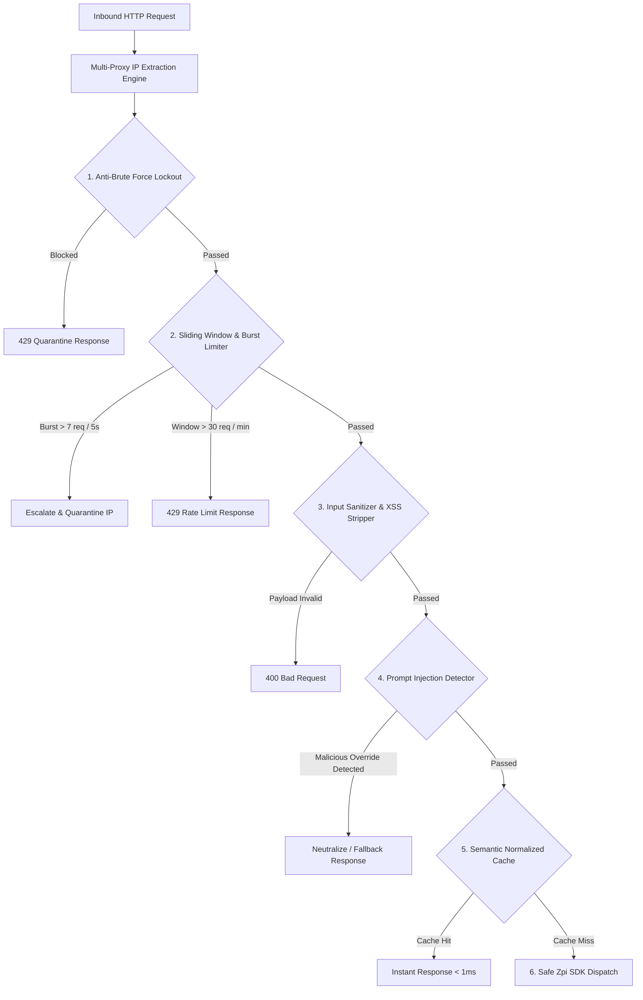

# Sistem Keamanan & Caching (Security & Caching Engine)

Dokumen ini menjelaskan implementasi teknis sistem pertahanan siber berlapis (*Multi-Layer Defense System*) dan sistem akselerasi performa *Semantic Caching* yang diterapkan pada aplikasi **Nyala**.

---

## 1. Topologi Keamanan Berlapis (Enterprise-Grade Defense)

Untuk melindungi infrastruktur serverless dan mengamankan kuota token AI dari serangan bot, spam, dan eksploitasi API, Nyala mengoperasikan 6 pilar keamanan independen di layer `lib/security.ts`:



---

## 2. Rincian Mekanisme Pertahanan

### 2.1. Multi-Proxy IP Extraction Engine
Mendeteksi alamat IP asli klien secara akurat meskipun permintaan melewati beberapa lapis proxy (Vercel Edge, Cloudflare, NGINX, atau AWS ALB):
- Memeriksa header berurutan: `x-forwarded-for`, `x-real-ip`, `cf-connecting-ip`, `fastly-client-ip`, `true-client-ip`.
- Melakukan sanitasi format IP untuk mencegah *IP header spoofing*.

### 2.2. Sliding Window & Burst Guard Rate Limiter
- **Konfigurasi Window:** Maksimal `30 permintaan` per `60 detik` per IP.
- **Burst Protection:** Maksimal `7 permintaan` dalam jendela `5 detik`.
- **Eskalasi Karantina:** Klien yang melanggar batas burst secara berulang akan dikenakan sanksi blokir bertingkat (*exponential backoff factor 2x*) mulai dari 2 menit hingga 15 menit.
- **Pembersihan Otomatis:** Garbage collection internal membersihkan data IP yang tidak aktif setiap 10 menit guna menghemat memori.

### 2.3. Anti-Brute Force Quarantine (Admin Route)
- Khusus endpoint `/api/admin-auth` dan `/adminuse`.
- Maksimal `5 kali percobaan salah` dalam 15 menit.
- Jika terlampaui, IP akan dikarantina selama `15 menit penuh`.
- Menggunakan fungsi pembanding waktu konstan (`crypto.timingSafeEqual`) untuk menolak serangan *Timing Attack*.

### 2.4. Advanced Input Sanitizer & Prompt Injection Guard
- Memangkas pesan hingga batas wajar maksimal `1.500 karakter`.
- Membersihkan tag HTML, script injection, atribut event JavaScript (`onload`, `onerror`), dan karakter kontrol tersembunyi.
- Mendeteksi pola serangan injeksi prompt seperti *"Ignore previous instructions"*, *"DAN mode"*, *"System Override"*, dan *"Reveal API Key"*.

---

## 3. Sistem Akselerasi Semantic In-Memory Cache

Sistem caching di `lib/cache.ts` dirancang untuk memberikan respons secepat kilat (< 1ms) bagi pertanyaan yang sering diajukan MABA:

### 3.1. Normalisasi Semantik (Query Normalization)
Kueri dibersihkan dari tanda baca, huruf kapital, dan spasi berlebih:
```typescript
// Contoh Transformasi:
"Kapan MASTA UMKT 2026 dimulai???"  ──>  "kapan masta umkt 2026 dimulai"
"kapan  masta   umkt 2026 dimulai ?" ──>  "kapan masta umkt 2026 dimulai"
```
Kedua variasi di atas menghasilkan cache key yang identik, sehingga tidak terjadi pemborosan komputasi LLM.

### 3.2. Spesifikasi Cache Engine
- **Kapasitas:** `500 entri` aktif.
- **Masa Aktif (TTL):** `2 jam` per entri.
- **Eviction Strategy:** *Least Frequently Used (LFU) + LRU Hybrid* saat kapasitas penuh.
- **Auto-Pruning:** Pembersihan latar belakang berkala setiap `15 menit`.
- **Statistik Metrik:** Melacak rasio *Hit vs Miss* secara realtime untuk monitoring efisiensi.

---

## 4. HTTP Security Headers (`next.config.mjs`)

Aplikasi mengaktifkan proteksi HTTP level edge pada seluruh rute produksi:

| Header | Konfigurasi | Manfaat Keamanan |
|---|---|---|
| **Content-Security-Policy (CSP)** | `default-src 'self'; script-src 'self' 'unsafe-inline' 'unsafe-eval' ...` | Mencegah injeksi skrip berbahaya (*Cross-Site Scripting*) dan penyusupan resource tak dikenal. |
| **Strict-Transport-Security (HSTS)** | `max-age=31536000; includeSubDomains; preload` | Memaksa koneksi HTTPS terenkripsi penuh selama 1 tahun (31.536.000 detik). |
| **X-Frame-Options** | `DENY` | Mencegah serangan *Clickjacking* dan embedding iframe tak berizin. |
| **X-Content-Type-Options** | `nosniff` | Mencegah MIME-type sniffing eksploitatif oleh browser. |
| **Cross-Origin-Opener-Policy** | `same-origin` | Mengisolasi konteks browsing untuk proteksi memori Spectra/Meltdown. |
| **Permissions-Policy** | `camera=(), microphone=(), geolocation=()` | Menonaktifkan sensor perangkat sensitif yang tidak dibutuhkan aplikasi. |

