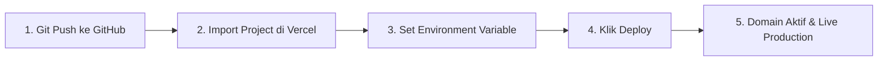

# Panduan Deployment Vercel (Deployment Guide)

Dokumen ini memandu langkah-langkah *deployment* aplikasi **Nyala** ke platform **Vercel** secara cepat, aman, dan berkinerja tinggi.

---

## 1. Prasyarat Deployment

Sebelum melakukan proses deploy, pastikan Anda memiliki:
1. Akun aktif di [Vercel](https://vercel.com/).
2. Repositori Git proyek (GitHub, GitLab, atau Bitbucket).
3. API Key Zpi (jika ingin mengaktifkan model AI daring `ai:z-ai` GLM-4.7).

---

## 2. Langkah-Langkah Deployment



### Langkah 1: Kloning & Pengujian Lokal
Pastikan build lokal berjalan tanpa galat:
```bash
npm run build
```
Pastikan menghasilkan status sukses (*Exit Code 0*).

### Langkah 2: Hubungkan Repositori ke Vercel
1. Buka [Vercel Dashboard](https://vercel.com/dashboard).
2. Klik tombol **"Add New..."** lalu pilih **"Project"**.
3. Pilih repositori **`Nyala_RangkingsUMKT`** (atau nama repositori Anda).

### Langkah 3: Konfigurasi Project Settings
- **Framework Preset:** Next.js
- **Root Directory:** `./`
- **Build Command:** `next build` (default)
- **Output Directory:** `.next` (default)
- **Install Command:** `npm install` (default)

### Langkah 4: Pengaturan Environment Variables
Tambahkan variabel lingkungan berikut pada menu **"Environment Variables"**:

| Key | Value Contoh | Wajib? | Keterangan |
| :--- | :--- | :---: | :--- |
| `ZPI_API_KEY` | `zpi_xxxxxxxxxxxxxxxxxxxxxxxx` | Opsional | Kunci API untuk AI Companion. Jika kosong, sistem otomatis memakai Smart Local Engine. |
| `NODE_ENV` | `production` | Otomatis | Dikelola langsung oleh Vercel. |

### Langkah 5: Klik Deploy
Klik tombol **"Deploy"**. Vercel akan mengompilasi aplikasi, mengoptimalkan aset statis, dan menerbitkan URL produksi (misal: `https://nyala-umkt.vercel.app/`).

---

## 3. Konfigurasi Custom Domain (Opsional)

Untuk menghubungkan ke subdomain resmi kampus (misal `https://nyala.umkt.ac.id/`):
1. Masuk ke menu **Project Settings > Domains**.
2. Tambahkan domain tujuan.
3. Tambahkan rekod DNS berikut pada panel domain manager:
   - **CNAME:** `cname.vercel-dns.com.` (untuk subdomain)
   - **A Record:** `76.76.21.21` (untuk apex domain)

---

## 4. Pemecahan Masalah (Troubleshooting)

### Kendala 1: AI Chat Mengeluarkan Fallback Terus-menerus
- **Penyebab:** Variabel `ZPI_API_KEY` belum terpasang atau salah format di Vercel Settings.
- **Solusi:** Periksa kembali penulisan key di *Environment Variables*, lalu lakukan *Redeploy* (Pilih menu Deployments > ... > Redeploy).

### Kendala 2: Rate Limit Terlalu Ketat pada Jaringan Kampus Bersama
- **Penyebab:** Ratusan mahasiswa berada di bawah satu IP NAT publik WiFi kampus yang sama.
- **Solusi:** Di `lib/security.ts`, sesuaikan konstanta `MAX_REQUESTS_PER_WINDOW` menjadi lebih besar (misal 60 req/menit) jika aplikasi digunakan serentak saat hari H MASTA.
