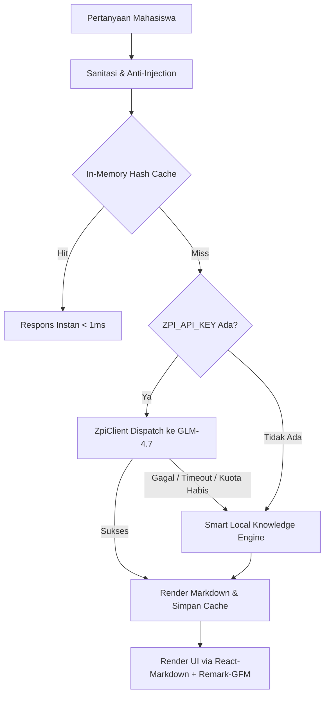

# Panduan Asisten Virtual: Tanya Nyala AI Companion

Dokumen ini memaparkan spesifikasi teknis dan panduan operasional asisten virtual cerdas **Tanya Nyala**, sebuah modul AI companion yang didedikasikan untuk membimbing Mahasiswa Baru (MABA) UMKT 2026.

---

## 1. Persona & Prinsip Komunikasi Nyala

- **Identitas Karakter:** Sahabat senior dan kakak tingkat teladan yang cerdas, suportif, empatik, dan berenergi hangat.
- **Tagline:** *"Nyala. Teman perjalanan MABA-mu."*
- **Semboyan TI:** *"HIDUP TEKNIK! NO SKILL NO TRUST!"*
- **Tone of Voice:** Komunikatif, solutif, menghargai mahasiswa baru, bebas dari arogansi birokrasi, dan terstruktur rapi.

---

## 2. Arsitektur Engine & Integrasi Zpi SDK

Tanya Nyala menggunakan integrasi **Zpi SDK (`zpi-sdk`)** yang terhubung dengan model kecerdasan buatan **GLM-4.7 (`ai:z-ai`)**:

---

## 3. Basis Pengetahuan Faktual (Grounding Data)

Untuk mencegah halusinasi (*Anti-Hallucination Guardrails*), prompt sistem dibekali data resmi berikut:

1. **Jadwal Resmi MASTA 2026:**
   - 06 Agustus 2026: Pembekalan Daring via Zoom.
   - 11–12 Agustus 2026: Masta Fakultas (FEBP & Saintek FST).
   - 18–20 Agustus 2026: MASTA IMM (3 Gelombang, 9 Fakultas, 3.755 Mahasiswa).
   - 24 & 26 Agustus 2026: Kuliah Umum Universitas Daring (08.00–17.00 WITA).
   - 28 Agustus 2026: Luring Kampus (Pagi: UKM Expo, Malam: Puncak Milad & Inaugurasi).
2. **Aturan Dresscode & Tata Tertib:**
   - Daring: Zoom On-Cam, format nama `[Nomor Gugus]_[Nama Lengkap]`.
   - Luring Pagi: Kaos UMKT / Olahraga, celana training, sepatu olahraga, jilbab hitam (wanita).
   - Luring Malam: Kemeja putih, celana/rok hitam formal, jas almamater, songkok hitam (pria) / jilbab hitam (wanita).
3. **Kontak Resmi Admin:**
   - PMB UMKT: `+62 811-5555-573`
   - Kemahasiswaan: `+62 822-5555-3733`
   - Admin FST: `+62 813-4623-1114`
   - Helpdesk SIKAD: `+62 852-4751-2244`

---

## 4. Smart Local Knowledge Fallback Engine

Jika sambungan internet terputus, API key belum disetel, atau limit tercapai, Nyala secara cerdas menggunakan mesin pencarian semantik lokal berbasis *Keyword & Intent Matching* yang mencakup 20+ skenario umum:
- Pertanyaan jadwal dan pembagian gelombang.
- Tata cara pengisian KRS dan presensi minimal 75% di SIKAD.
- Kurikulum dan mata kuliah semester 1 prodi TI.
- Tips adaptasi, kost, dan transportasi di Samarinda.

---

## 5. Rendering Tampilan Markdown

Balasan AI diproses menggunakan `react-markdown` dan `remark-gfm`:
- **Tabel:** Otomatis berbalut kontainer horizontal-scroll yang responsif di layar ponsel.
- **Daftar & Penomoran:** Indentasi rapi dengan spasi lega.
- **Blok Kode:** Kotak abu-abu berlatar gelap dengan jenis huruf monospace.
- **Tautan Eksternal:** Terbuka di tab baru (`target="_blank" rel="noopener noreferrer"`).
