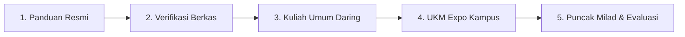

# Kurikulum & Panduan Resmi MASTA UMKT 2026

Dokumen ini memuat rangkuman terstruktur pelaksanaan **Masa Ta'aruf Mahasiswa Baru (MASTA)** Universitas Muhammadiyah Kalimantan Timur (UMKT) Tahun Akademik 2026/2027.

---

## 1. Alur 5 Tahapan Utama MASTA

Pelaksanaan orientasi mahasiswa baru diorganisasikan ke dalam 5 tahapan berurutan:

### Tahap 1: Membaca Panduan Resmi
- **Fokus:** Memahami hak, kewajiban, tata tertib berpakaian, etika komunikasi, dan jadwal gelombang.
- **Rujukan:** Dokumen resmi Biro Kemahasiswaan & Portal MASTA Odoo (`masta-maba.odoo.com`).

### Tahap 2: Verifikasi Identitas & Gugus
- **Fokus:** Pengecekan Nomor Induk Mahasiswa (NIM), konfirmasi gugus MASTA, dan join grup koordinasi WhatsApp resmi.
- **Format Display Name Zoom:** `[Nomor Gugus]_[Nama Lengkap]` (contoh: `Gugus 04_Ahmad Dahlan`).

### Tahap 3: Kegiatan Daring Universitas (Zoom Meeting)
- **Waktu:** 24 & 26 Agustus 2026 (Pukul 08.00 – 17.00 WITA).
- **Materi Pokok:** Pengenalan Visi Misi UMKT, Al-Islam Kemuhammadiyahan (AIK), pengenalan sistem akademik SIKAD, layanan perpustakaan digital, serta biro kemahasiswaan.
- **Kewajiban:** On-camera sepanjang sesi berlangsung dengan background resmi MASTA.

### Tahap 4: UKM Expo (Luring di Kampus)
- **Waktu:** Jumat, 28 Agustus 2026 (Sesi Pagi: 06.30 – 11.30 WITA).
- **Lokasi:** Lapangan dan Hall Gedung Utama Kampus UMKT Samarinda.
- **Aktivitas:** Pengenalan puluhan Unit Kegiatan Mahasiswa (Olahraga, Seni, Pecinta Alam, Robotika, Tapak Suci, Hizbul Wathan, dll.).

### Tahap 5: Puncak Milad, Inaugurasi, & Sertifikat
- **Waktu:** Jumat, 28 Agustus 2026 (Sesi Malam: 17.00 – 22.00 WITA).
- **Aktivitas:** Pengukuhan resmi mahasiswa baru oleh Rektor, malam inagurasi seni, dan penerbitan sertifikat kelulusan MASTA sebagai syarat kelulusan sarjana (SKPI).

---

## 2. Empat Pilar Capaian MASTA

1. **Orientasi Holistik:** Memahami tata kelola perguruan tinggi, sarana kampus, dan regulasi akademik.
2. **Kesiapan Akademik:** Menguasai operasional portal SIKAD, pengisian KRS online, dan pemenuhan presensi kuliah minimum 75%.
3. **Relasi & Kolaborasi:** Membangun jejaring pertemanan lintas fakultas dan mengenal wadah organisasi kemahasiswaan.
4. **Karakter Kemuhammadiyahan:** Menanamkan integritas moral, nilai-nilai Al-Islam, dan etika keilmuan berkemajuan.

---

## 3. Tiga Fokus Pembinaan

- **Fokus 1: Adaptasi Cepat Kampus** — Menjembatani transisi dari pola belajar SMA ke kemandirian berpikir tingkat tinggi mahasiswa universitas.
- **Fokus 2: Pembentukan Karakter Unggul** — Mengasah kepemimpinan, kepedulian sosial, dan kedisiplinan berlandaskan akhlak mulia.
- **Fokus 3: Pemanfaatan Peluang Riset & Karir** — Mendorong partisipasi awal dalam Program Kreativitas Mahasiswa (PKM), kompetisi inovasi, dan magang industri.

---

## 4. Checklist Perlengkapan Wajib MABA

| Kategori | Item Wajib | Keterangan |
| :--- | :--- | :--- |
| **Dokumen** | Kartu Registrasi / Bukti Pembayaran PMB | Salinan digital & cetak |
| **Dokumen** | Pasfoto formal jas/kemeja background merah/biru | File digital format JPG/PNG |
| **Perangkat**| Laptop / PC + Webcam berfungsi | Untuk sesi Zoom daring & praktikum |
| **Perangkat**| Koneksi internet stabil (kuota cadangan) | Minimum kecepatan 5 Mbps |
| **Pakaian** | Kemeja putih lengan panjang formal | Dipakai saat pembukaan & penutupan |
| **Pakaian** | Celana/rok panjang hitam (bukan jeans ketat) | Standar etika busana UMKT |
| **Pakaian** | Jas Almamater UMKT | Digunakan pada puncak acara |
| **Kesehatan**| Air minum 2 liter & obat-obatan pribadi | Menjaga stamina selama sesi berlangsung |
