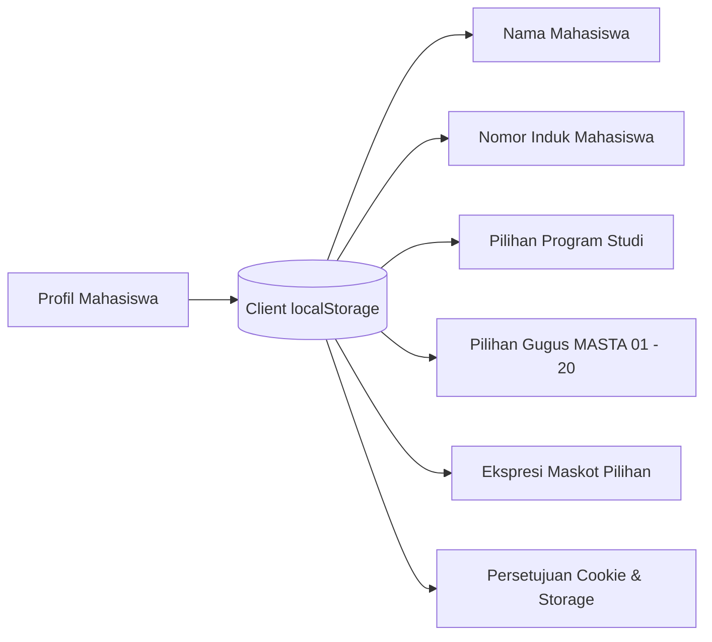

# Arsitektur Mobile Native & PWA (/mobile/*)

Dokumen ini menjelaskan rancang bangun antarmuka **True Fluid Responsive Native App** (`/mobile/*`) dan kapabilitas **Progressive Web App (PWA)** pada aplikasi Nyala.

---

## 1. Konsep & Filosofi Antarmuka Mobile

Berbeda dari situs web responsif biasa yang hanya mengecilkan ukuran kontainer desktop, Nyala menyediakan arsitektur khusus untuk perangkat seluler:

- **Isolasi Layout Total:** Rute `/mobile/*` memiliki `MobileAppLayout` tersendiri yang sepenuhnya memisahkan navigasi desktop (mencegah *double navbar* atau *double dock*).
- **True Fluid Native Touch Feel:** Tidak menggunakan bingkai/mockup buatan (*no artificial phone mockup frame*) yang membatasi layar. Seluruh lebar dan tinggi viewport dimanfaatkan secara optimal.
- **Haptic Visual Feedback:** Tombol dan kartu merespons sentuhan dengan efek pegas `scale(0.97)` saat ditekan.
- **Safe Area Insets:** Penyesuaian jarak otomatis terhadap lekukan layar iPhone (*notch* / *Dynamic Island*) dan bar navigasi bawah Android (`pb-safe`, `pt-safe`).

---

## 2. Floating Bottom Dock Bar

Navigasi utama mobile diletakkan pada bilah terapung di bagian bawah layar yang mudah dijangkau oleh satu ibu jari (*one-hand thumb reachability*):

| Tab Navigasi | Rute | Ikon | Keterangan |
| :--- | :--- | :--- | :--- |
| **Beranda** | `/mobile` | `House` | Ringkasan countdown, kartu prodi, dan jadwal terdekat |
| **Jadwal** | `/mobile/jadwal` | `CalendarCheck` | Alur 5 tahapan MASTA dan linimasa tanggal resmi |
| **Tanya AI** | `/mobile/companion` | `Sparkle` | Asisten virtual Nyala (tombol aksi sentral menonjol) |
| **Hub UMKT** | `/mobile/hub-umkt` | `Globe` | Berita resmi, agenda kampus, dan artikel blog |
| **Profil** | `/mobile/profile` | `User` | Pengaturan biodata MABA, gugus, tema, dan preferensi |

Selain 5 tab utama, menu laci (*Drawer Menu*) dapat dibuka melalui tombol menu atas untuk mengakses:
- Panduan SIKAD (`/mobile/panduan-sikad`)
- Panduan TI (`/mobile/panduan-ti`)
- Health & Mood Tracker (`/mobile/health-check`)
- Checklist Persiapan (`/mobile/checklist`)
- Switcher ke Tampilan Desktop Web

---

## 3. Sistem Profil & Penyimpanan Data Lokal

Modul `/mobile/profile` memberikan kontrol penuh kepada mahasiswa baru untuk menyesuaikan identitasnya:

- **Keamanan Privasi:** Seluruh data disimpan secara lokal pada perangkat pengguna (`localStorage.getItem("nyala_user_profile")`). Tidak ada data personal yang dikirimkan ke server tanpa izin.
- **Sinkronisasi Otomatis:** Perubahan nama atau gugus pada profil secara otomatis menyinkronkan format display name pada prompt AI Companion dan kartu status beranda.

---

## 4. Konfigurasi Progressive Web App (PWA)

Aplikasi dapat diinstal langsung ke layar utama (*Add to Home Screen*) ponsel Android dan iOS tanpa melalui toko aplikasi pihak ketiga:

- **Manifest Web (`public/manifest.json`):**
  - `name`: *"Nyala - Teman Perjalanan MABA UMKT 2026"*
  - `short_name`: *"Nyala"*
  - `display`: *"standalone"* (menghilangkan bilah browser URL)
  - `theme_color`: `"#FF5A1F"`
  - `background_color`: `"#FAFAF9"`
- **Service Worker (`public/sw.js`):**
  - Meng-cache berkas statis inti (CSS, Font, Ikon, Gambar Maskot) untuk memastikan aplikasi tetap dapat dibuka saat jaringan luring.
