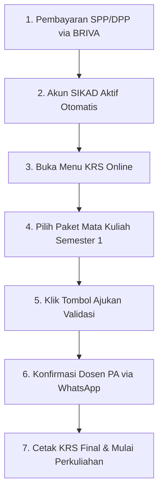

# Panduan & Simulator SIKAD Mahasiswa UMKT

Dokumen ini menjelaskan operasional **Sistem Informasi Akademik (SIKAD)** Universitas Muhammadiyah Kalimantan Timur (`https://mahasiswa.umkt.ac.id/`) serta modul simulator interaktif yang tersedia di rute `/panduan-sikad`.

---

## 1. Kredensial Login SIKAD Resmi
- **Username:** NIM (Nomor Induk Mahasiswa) resmi sepanjang **13 digit** (contoh: `2611102441001`).
- **Password Default:** Nomor Registrasi Pendaftaran yang diawali angka **`12xxxxxx`**.
- **Keamanan:** Setelah login pertama kali berhasil, mahasiswa sangat disarankan untuk segera mengganti password di menu Pengaturan Akun SIKAD.

---

## 2. Fungsi Utama Portal SIKAD

SIKAD merupakan pusat layanan digital terpadu bagi seluruh aktivitas akademik mahasiswa UMKT:

1. **Dashboard & Biodata:** Menampilkan status registrasi semester, Nomor Induk Mahasiswa (NIM 13 digit), data Dosen Pembimbing Akademik (PA), serta pengumuman penting universitas.
2. **KRS Online (Kartu Rencana Studi):** Tempat pemilihan mata kuliah semester baru, pemilihan jadwal kelas, dan pengajuan validasi ke Dosen PA.
3. **Jadwal Kuliah Mingguan:** Kalender jadwal perkuliahan, kode ruangan, dan tautan kelas online (Zoom/OpenLearning).
4. **Presensi Kuliah Digital:** Pelacak kehadiran perkuliahan dengan **aturan ambang batas minimum 75%** agar berhak mengikuti Ujian Akhir Semester (UAS).
5. **Keuangan & Tagihan BRIVA:** Pengecekan status tagihan SPP/DPP, nomor Virtual Account BRI, dan konfirmasi pembayaran otomatis.
6. **KHS & Transkrip Nilai:** Laporan Indeks Prestasi Semester (IPS) dan Indeks Prestasi Kumulatif (IPK).

---

## 2. Prosedur Pengisian KRS Online



### Tips Pengisian KRS untuk MABA Angkatan 2026:
- Mahasiswa Baru Semester 1 umumnya mengambil **paket mata kuliah wajib (20 SKS)** yang telah dipaketkan secara otomatis oleh Program Studi.
- Pastikan tidak ada bentrok jadwal antar mata kuliah sebelum mengajukan validasi.
- Jika tombol *"Ajukan Validasi"* belum aktif, pastikan pembayaran administrasi tahap awal telah terverifikasi oleh bagian keuangan.

---

## 3. Template Etika Chat Dosen Pembimbing Akademik (PA)

Dalam aplikasi Nyala, disediakan fitur *one-click copy* template pesan WhatsApp resmi yang sopan dan sesuai standar etika akademik:

```text
Assalamu'alaikum Warahmatullahi Wabarakatuh,

Selamat pagi/siang Bapak/Ibu [Nama Dosen PA],
Mohon maaf mengganggu waktu Bapak/Ibu.

Perkenalkan, saya:
Nama: [Nama Lengkap Mahasiswa]
NIM: [Nomor Induk Mahasiswa]
Program Studi: S1 Teknologi Informasi (Angkatan 2026)

Izin menyampaikan bahwa saya telah menyelesaikan pengisian Kartu Rencana Studi (KRS) untuk Semester Ganjil 2026/2027 melalui portal SIKAD sejumlah [20] SKS.

Mohon kesediaan Bapak/Ibu untuk memeriksa dan memberikan validasi/persetujuan pada sistem SIKAD.

Terima kasih banyak atas bimbingan dan waktu yang Bapak/Ibu berikan.

Wassalamu'alaikum Warahmatullahi Wabarakatuh.
```

---

## 4. Aturan Presensi Minimum 75%

UMKT memberlakukan standar kedisiplinan ketat terkait presensi mahasiswa:
- Total pertemuan dalam 1 semester adalah **16 sesi** (14 sesi kuliah + UTS + UAS).
- Mahasiswa wajib menghadiri minimal **12 sesi (75%)**.
- Mahasiswa dengan presensi di bawah 75% **tidak diperkenankan mengikuti UAS** dan mata kuliah tersebut dinyatakan tidak lulus (*grade E*).
