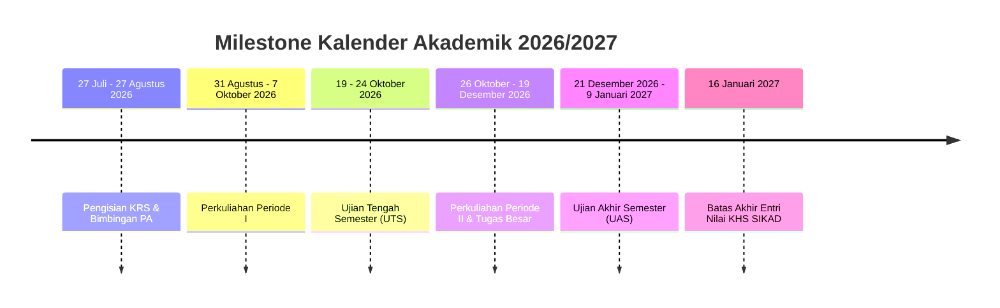

# Panduan Akademik & Karir Program Studi S1 Teknologi Informasi UMKT

Dokumen ini memuat panduan komprehensif kurikulum akademik, profil dosen pengampu, kalender perkuliahan, serta prospek karir mahasiswa Program Studi **S1 Teknologi Informasi (Fakultas Sains dan Teknologi UMKT)**.

---

## 1. Profil & Visi Keilmuan Program Studi

- **Nama Program Studi:** S1 Teknologi Informasi
- **Fakultas:** Fakultas Sains dan Teknologi (FST)
- **Gelar Lulusan:** Sarjana Komputer (`S.Kom`)
- **Akreditasi:** **Baik Sekali** (Berlaku 2025 – 2030)
- **Semboyan Kebanggaan:** *"HIDUP TEKNIK! NO SKILL NO TRUST!"*
- **Visi Keilmuan 2037:**
  > *"Menjadi program studi yang unggul dalam teknologi informasi dan algoritma komputasi untuk penyelesaian permasalahan sosial dan lingkungan dengan berlandaskan nilai-nilai keislaman."*

### Konsentrasi Keilmuan Utama:
1. **Jaringan dan Rekayasa Sistem (JRS):** Cloud Architecture, Network Security, IoT, dan DevOps.
2. **Komputasi Cerdas (KC):** Artificial Intelligence, Machine Learning, Data Science, dan Computer Vision.

---

## 2. Struktur Kurikulum Semester 1 s.d. 4

### Semester 1 (Fondasi Komputasi — 20 SKS)
| Kode MK | Nama Mata Kuliah | SKS | Kategori |
| :--- | :--- | :--- | :--- |
| `CSE1013` | Aljabar Linear | 3 | Wajib Prodi |
| `CSE1023` | Matematika Diskrit | 3 | Wajib Prodi |
| `CSE1033` | Statistika | 3 | Wajib Prodi |
| `CSE1043` | Dasar Pemrograman | 3 | Wajib Prodi |
| `CSE1054` | Praktikum Dasar Pemrograman | 1 | Praktikum Lab |
| `CSE1063` | Sistem Digital dan Arsitektur Komputer | 3 | Wajib Prodi |
| `UNI1012` | Kemanusiaan dan Keimanan / Islamologi 1 | 2 | Universitas |
| `UNI1022` | Aplikasi Komputer & Pengantar TI | 2 | Universitas |

### Semester 2 (Struktur Data & Jaringan — 21 SKS)
| Kode MK | Nama Mata Kuliah | SKS | Kategori |
| :--- | :--- | :--- | :--- |
| `CSE1073` | Algoritma dan Struktur Data | 3 | Wajib Prodi |
| `CSE1083` | Praktikum Algoritma dan Struktur Data | 1 | Praktikum Lab |
| `CSE1093` | Basis Data | 3 | Wajib Prodi |
| `CSE1103` | Praktikum Basis Data | 1 | Praktikum Lab |
| `CSE1113` | Jaringan Komputer | 3 | Wajib Prodi |
| `CSE1123` | Praktikum Jaringan Komputer | 1 | Praktikum Lab |
| `CSE1133` | Technopreneurship | 2 | Wajib Prodi |
| `UNI1113` | Ibadah, Akhlak dan Muamalah / Islamologi 2 | 2 | Universitas |
| `UNI1053` | Bahasa Indonesia | 2 | Universitas |
| `UNI1043` | Pancasila | 2 | Universitas |

### Semester 3 (Web & Kecerdasan Buatan — 21 SKS)
| Kode MK | Nama Mata Kuliah | SKS | Kategori |
| :--- | :--- | :--- | :--- |
| `CSE2143` | Kalkulus | 3 | Wajib Prodi |
| `CSE2153` | Pemrograman Web | 3 | Wajib Prodi |
| `CSE2163` | Praktikum Pemrograman Web | 1 | Praktikum Lab |
| `CSE2173` | Pemrograman Berorientasi Objek (OOP) | 3 | Wajib Prodi |
| `CSE2183` | Praktikum OOP | 1 | Praktikum Lab |
| `CSE2193` | Kompleksitas Algoritma | 3 | Wajib Prodi |
| `CSE2203` | Kecerdasan Buatan (AI) | 3 | Wajib Prodi |
| `UNI2023` | Kemuhammadiyahan | 2 | Universitas |
| `UNI2033` | Kewarganegaraan | 2 | Universitas |

### Semester 4 (Machine Learning, Mobile, & Security — 20 SKS)
| Kode MK | Nama Mata Kuliah | SKS | Kategori |
| :--- | :--- | :--- | :--- |
| `CSE2223` | Rekayasa Perangkat Lunak | 3 | Wajib Prodi |
| `CSE2233` | Pemrograman Web Lanjut | 3 | Wajib Prodi |
| `CSE2213` | Praktikum Pemrograman Web Lanjut | 1 | Praktikum Lab |
| `CSE2243` | Machine Learning dan Big Data | 3 | Wajib Prodi |
| `CSE2253` | Pemrograman Mobile (Mobile Programming) | 3 | Wajib Prodi |
| `CSE2263` | Praktikum Pemrograman Mobile | 1 | Praktikum Lab |
| `CSE2273` | Keamanan Komputer dan Jaringan | 3 | Wajib Prodi |
| `CSE2283` | Praktikum Keamanan Komputer | 1 | Praktikum Lab |
| `FST2012` | Etika dan Hukum Profesi (K3) | 2 | Fakultas (FST) |

---

## 3. Direktori Dosen Tetap Program Studi TI

| No | Nama Dosen | Bidang Keahlian Pokok | Status |
| :- | :--- | :--- | :--- |
| 1 | **Abdul Rahim, S.Kom., M.Kom.** | Computer Science, Software Architecture | Aktif Mengajar |
| 2 | **Arbansyah, S.Kom., M.Kom.** | Internet of Things (IoT), Embedded Systems | Aktif Mengajar |
| 3 | **Naufal Azmi Verdikha, S.Kom., M.Kom.** | Machine Learning, NLP, Big Data | Aktif Mengajar |
| 4 | **Taghfirul Azhima Yoga Siswa, M.Kom.** | Data Science, Deep Learning | Tugas Belajar (S3) |
| 5 | **Asslia Johar Latifah, M.Kom.** | Machine Learning, Image Processing | Tugas Belajar (S3) |
| 6 | **Faldi, S.Kom., M.Cs.** | Computer Networking, Cloud Computing | Tugas Belajar (S3) |
| 7 | **Rofilde Hasudungan, M.Kom.** | Machine Learning, DNA Computing | Tugas Belajar (S3) |
| 8 | **Sayekti Harits Suryawan, M.Kom.** | Simulation & Modelling, Sustainable Tech | Tugas Belajar (S3) |
| 9 | **Rudiman, S.Kom., M.Kom.** | GIS, Machine Learning, Remote Sensing | Tugas Belajar (S3) |
| 10 | **Wawan Joko Pranoto, M.Kom.** | Data Analytics, Business Intelligence | Tugas Belajar (S3) |
| 11 | **Abd Hallim, S.Kom., M.Kom.** | Cyber Security, Kriptografi | Tugas Belajar (S3) |

---

## 4. Standar Nilai Kelulusan Minimum

| Kategori Mata Kuliah | Nilai Minimum | Keterangan |
| :--- | :---: | :--- |
| **Mata Kuliah Wajib Prodi** | `C` | Bobot 2.0 (Wajib diulang jika D/E) |
| **Mata Kuliah Dasar Umum (MKDU)** | `B` | Bobot 3.0 |
| **Mata Kuliah Konsentrasi (JRS / KC)** | `C` | Prasyarat Skripsi |
| **Praktikum / Tugas Proyek** | `BC` | Bobot 2.5 |
| **Kerja Praktik / Magang Industri** | `B` | Prasyarat Ujian Sidang |
| **Skripsi / Capstone Project** | `AB` | Bobot 3.5 (Standar Sarjana Unggul) |

---

## 5. Kalender Akademik Semester Ganjil 2026/2027

---

## 6. Organisasi Mahasiswa: HIMATIF UMKT

**Himpunan Mahasiswa Teknik Informatika (HIMATIF)** merupakan wadah aspirasi, kepemimpinan, dan pengembangan kompetensi teknologi bagi mahasiswa TI UMKT.

- **Fokus Divisi:** Divisi Keilmuan & Riset, Divisi Humas & Jaringan, Divisi Minat Bakat, serta Divisi Kerohanian & Sosial.
- **Program Unggulan:** *Informatics Championship*, Workshop Coding & Cyber Security, Bakti Sosial Komputasi Desa, dan *HIMATIF Gathering*.
