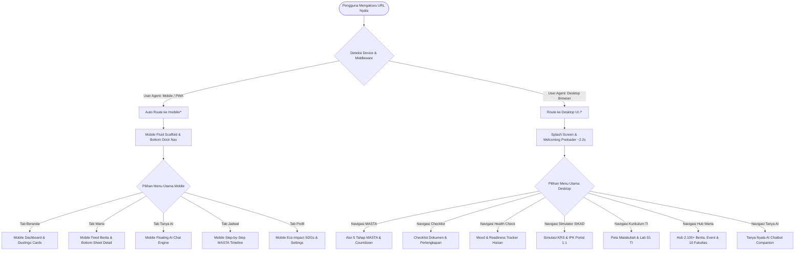
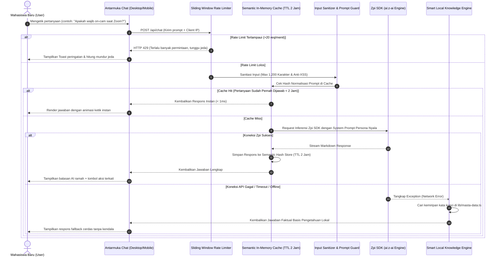
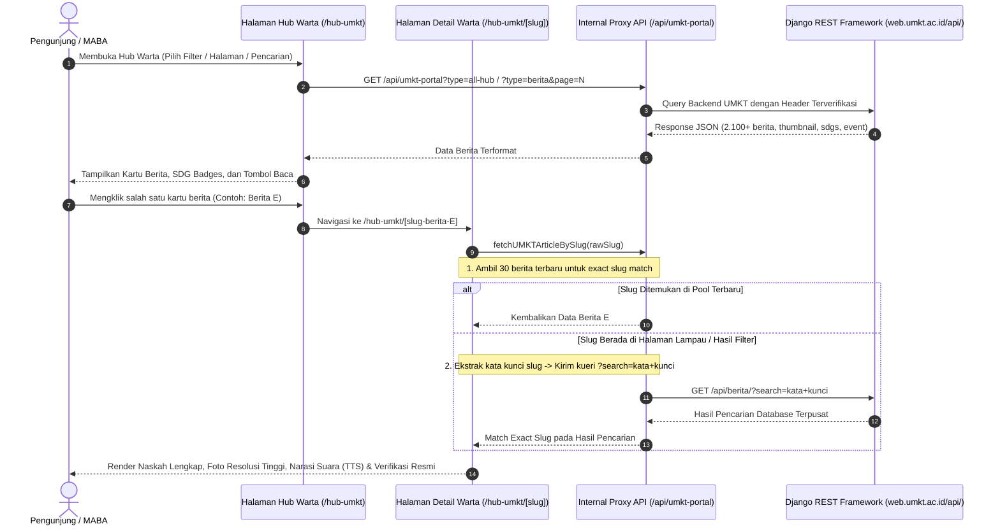
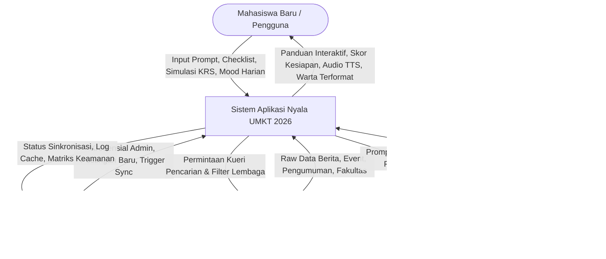
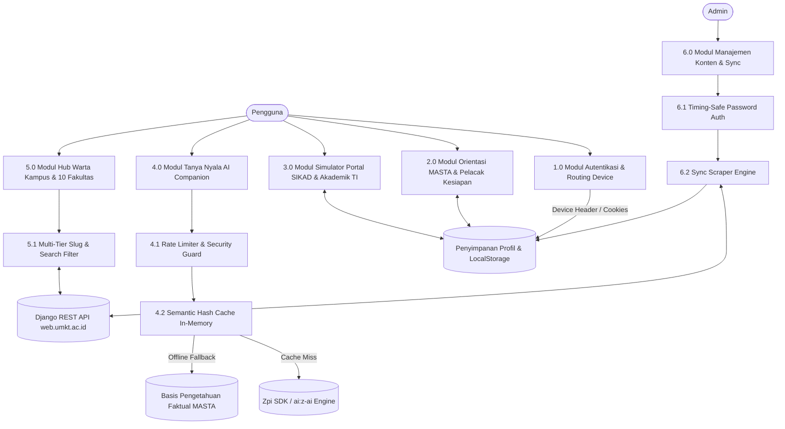

# Software Requirements Specification (SRS)
## Proyek: Nyala — Sahabat & Companion Perjalanan MABA UMKT 2026

- **Nama Aplikasi:** Nyala (Teman Perjalanan MABA-mu)
- **Pengembang / Creator:** Al-Ghani Desta Setyawan (@kou.sozo)
- **Afiliasi & Penerbit:** Al-Ghani Desta Setyawan & Kantor Pemeringkatan UMKT (https://www.umkt.ac.id/pemeringkatan/)
- **Target Pengguna:** Mahasiswa Baru (MABA) Universitas Muhammadiyah Kalimantan Timur Angkatan 2026, Mahasiswa Belum MASTA, Dosen PA, dan Civitas Akademika.
- **Domain Resmi:** [https://nyala-umkt.vercel.app](https://nyala-umkt.vercel.app)
- **Status Dokumen:** Versi 2.0 (Final Production Grade)
- **Tanggal Rilis:** 22 Agustus 2026

---

## 1. Pendahuluan & Gambaran Umum

### 1.1 Tujuan Dokumen
Dokumen Spesifikasi Kebutuhan Perangkat Lunak (*Software Requirements Specification* - SRS) ini mendefinisikan seluruh kebutuhan fungsional, non-fungsional, arsitektur data, diagram alir pengguna (*User Flow*), diagram relasi entitas (*ERD*), *Data Flow Diagram* (*DFD*), dan *Sequence Diagram* untuk sistem aplikasi web dan mobile PWA **Nyala**.

### 1.2 Cakupan Produk (Scope of Product)
Nyala adalah platform pendamping digital (*digital companion platform*) cerdas, interaktif, dan ramah lingkungan (*paperless green orientation*) yang dirancang khusus untuk memandu mahasiswa baru dalam melalui masa transisi orientasi universitas (Masa Ta'aruf / MASTA IMM), memahami tata kelola portal akademik SIKAD, menjelajahi kurikulum S1 Teknologi Informasi & 10 fakultas, mengakses warta resmi *real-time* terverifikasi, serta berkonsultasi 24/7 bersama asisten kecerdasan buatan (*Tanya Nyala AI*).

---

## 2. Kebutuhan Sistem & Aktor Pengguna

### 2.1 Matriks Aktor Sistem
| Aktor | Deskripsi & Peran | Akses Antarmuka |
|---|---|---|
| **Mahasiswa Baru (MABA)** | Pengguna utama yang membutuhkan navigasi alur MASTA, simulasi SIKAD, checklist perlengkapan, pelacak kesiapan fisik/mental harian, warta kampus, dan konsultasi AI. | Antarmuka Web Desktop (`/`) dan Antarmuka Native Mobile PWA (`/mobile/*`). |
| **Admin Humas / Dosen PA** | Administrator pengelola konten lokal, sinkronisasi rilis warta resmi Django REST API UMKT, dan verifikasi panduan akademik. | Panel Manajemen Konten (`/adminuse` & `/api/admin-auth`). |
| **Tamu / Pengunjung Umum** | Calon mahasiswa atau orang tua/wali yang ingin mengeksplorasi profil 10 fakultas, agenda IKN kampus, serta reputasi internasional UMKT. | Halaman Hub Warta Kampus (`/hub-umkt`) dan Beranda Publik. |
| **Sistem Eksternal (Django REST API UMKT)** | Server penyedia data terpusat `https://web.umkt.ac.id/api/` yang menyuplai 2.100+ artikel berita, pengumuman edaran resmi, event universitas, dan data fakultas. | Endpoint Terproteksi `/api/umkt-portal` & `/api/scrape-umkt`. |
| **Zpi AI Engine (Model ai:z-ai / GLM-4.7)** | Layanan Large Language Model pihak ketiga yang memproses kueri inferensi bahasa alami untuk modul *Tanya Nyala AI*. | Endpoint Terenkripsi `/api/chat`. |

---

## 3. Diagram Alir Sistem & Pengguna (System & User Flowchart)

### 3.1 Flowchart Utama Sistem (Main System Flowchart)

---

### 3.2 User Flow: Alur Konsultasi Tanya Nyala AI (AI Chat Companion Flow)

---

### 3.3 User Flow: Hub Warta Resmi & Pencarian Slug Multi-Tier (Live REST API Flow)

---

## 4. Entity Relationship Diagram (ERD) & Struktur Data

Aplikasi Nyala beroperasi menggunakan arsitektur *Hybrid State Storage* (perpaduan antara *LocalStorage Client Schema*, *Server In-Memory Semantic Cache Store*, *API REST Model Types*, dan *Curated Static Academic Knowledge Schema*).

```mermaid
erDiagram
    MASTA_PHASE ||--o{ CHECKLIST_ITEM : "memerlukan perlengkapan"
    MASTA_PHASE ||--o{ FAQS_ENTRY : "memiliki rujukan"
    
    USER_PROFILE ||--o{ DAILY_HEALTH_LOG : "mencatat setiap hari"
    USER_PROFILE ||--o{ USER_CHECKLIST_STATE : "menyimpan progres"
    USER_PROFILE ||--o{ SIKAD_SIMULATION_RECORD : "menyimpan rencana KRS"
    
    UMKT_BERITA ||--o{ UMKT_SDG_TAG : "terhubung ke target SDGs"
    UMKT_BERITA ||--o{ BERITA_CATEGORY : "dikelompokkan dalam"
    UMKT_FAKULTAS ||--o{ PRODI_ACADEMIC : "menaungi program studi"
    
    AI_CHAT_SESSION ||--o{ CACHE_RECORD : "dipercepat oleh semantic hash"

    USER_PROFILE {
        string nim PK "Nomor Induk Mahasiswa / ID Unik"
        string nama "Nama Lengkap Mahasiswa"
        string fakultas "Fakultas Pilihan (FST, FEBP, dll)"
        string prodi "Program Studi (S1 TI, S1 Kesmas, dll)"
        int paperlessSavedCount "Jumlah lembar kertas dihemat"
        float carbonSavedKg "Jejak karbon dihemat (Kg CO2)"
        string createdAt "Waktu pendaftaran profil lokal"
    }

    DAILY_HEALTH_LOG {
        string date PK "Tanggal Pencatatan (YYYY-MM-DD)"
        int moodScore "Skor Emosi (1-5: Senang, Cemas, Lelah, dll)"
        string moodNote "Catatan Refleksi Harian"
        boolean sleepCheck "Tidur Cukup 6-8 Jam"
        boolean mealCheck "Makan Teratur Bergizi"
        boolean waterCheck "Minum Air Minimal 2 Liter"
        boolean mentalCheck "Relaksasi / Ibadah Terjaga"
        int readinessScore "Skor Kesiapan Total (0-100%)"
    }

    USER_CHECKLIST_STATE {
        string itemId PK "ID Unik Item Checklist"
        string category "Kategori (Dokumen, Gadget, Pakaian, Obat)"
        string label "Deskripsi Perlengkapan"
        boolean isCompleted "Status Centang / Selesai"
        boolean isCustom "Apakah Ditambahkan Sendiri oleh User"
        string updatedAt "Waktu Terakhir Diperbarui"
    }

    SIKAD_SIMULATION_RECORD {
        string courseCode PK "Kode Matakuliah (Contoh: TI26101)"
        string courseName "Nama Matakuliah Kurikulum 2026"
        int sks "Bobot Satuan Kredit Semester (1-4 SKS)"
        string semester "Semester Pelaksanaan (1-8)"
        string predictedGrade "Prediksi Nilai Huruf (A, AB, B, BC, C)"
        float gradePoint "Bobot Angka Mutu (4.00, 3.50, dll)"
        boolean isEnrolled "Status Terpilih di Rencana KRS"
    }

    UMKT_BERITA {
        int id PK "ID Rilis Resmi CMS UMKT"
        string judul "Headline Berita Terpublikasi"
        string slug "URL Friendly Identifier"
        string isi "Naskah Artikel (Sanitized HTML)"
        string thumbnail "URL Gambar Miniatur"
        string foto "URL Foto Dokumentasi Utama"
        string tanggal "Waktu Publikasi ISO"
        string kode_lembaga "Kode Unit Pembuat (lmbg1001, dll)"
        boolean publish "Status Publikasi"
    }

    UMKT_SDG_TAG {
        int id PK "Nomor Goal SDG (1-17)"
        string sdgs "Label Resmi Target PBB (Goal 4: Pendidikan, dll)"
        string color "Kode Warna Heksadesimal Standar PBB"
    }

    UMKT_FAKULTAS {
        string id PK "Kode Identitas Fakultas (fst, febp, fkm, dll)"
        string name "Nama Resmi Fakultas"
        string code "Singkatan Lembaga"
        string description "Profil Singkat Fakultas"
        string buildingLocation "Gedung Perkuliahan di Kampus"
        string websiteUrl "Tautan Domain Sub-Web Resmi"
        string imageUrl "Dokumentasi Gedung Fakultas"
    }

    PRODI_ACADEMIC {
        string code PK "Kode Program Studi"
        string name "Nama Program Studi"
        string degree "Jenjang Pendidikan (S1 / D3 / Profesi)"
        string accreditation "Status Akreditasi LAM-PT / BAN-PT (Unggul/Baik Sekali)"
        int totalSksLulus "Syarat Minimal SKS Kelulusan (144 SKS)"
    }
```

---

## 5. Data Flow Diagram (DFD)

### 5.1 DFD Level 0 (Context Diagram)

---

### 5.2 DFD Level 1 (Decomposition Diagram)

---

## 6. Kebutuhan Fungsional (Functional Requirements)

| Kode FR | Modul | Deskripsi Kebutuhan Fungsional | Kriteria Penerimaan |
|---|---|---|---|
| **FR-001** | *Auto Device Routing* | Sistem wajib mendeteksi User Agent dan mengarahkan browser mobile ke rute `/mobile/*` secara mulus, serta mengarahkan browser desktop ke rute web padanannya. | Akses dari smartphone otomatis membuka rute mobile, akses dari laptop/desktop dialihkan ke tampilan desktop lebar. |
| **FR-002** | *Alur 5 Tahap MASTA* | Sistem wajib menyajikan visualisasi 5 tahapan resmi MASTA IMM, panduan perlengkapan pakaian, aturan Zoom On-Cam, dan live countdown waktu pelaksanaan. | Hitung mundur bergerak *real-time* per detik dengan akurasi zona waktu WITA (UTC+8). |
| **FR-003** | *Checklist Interaktif* | Sistem wajib menyediakan daftar periksa kebutuhan orientasi (Dokumen, Gadget, Pakaian, Kesehatan) dengan fitur centang, tambah item baru, serta animasi konfeti perayaan. | Status item tersimpan otomatis di `localStorage` tanpa hilang saat halaman dimuat ulang. |
| **FR-004** | *Health & Mood Tracker* | Sistem wajib memungkinkan MABA mencatat mood harian dan 4 indikator fisik, menghasilkan skor kesiapan 0-100%, rekomendasi kontekstual, dan riwayat 7 hari. | Riwayat grafik kesiapan 7 hari terakhir ter-update otomatis secara persisten. |
| **FR-005** | *Simulator SIKAD 1:1* | Sistem wajib menyediakan simulasi antarmuka portal akademik `mahasiswa.umkt.ac.id`, pemilihan KRS berbasis kuota SKS, kalkulator estimasi IPK, dan kartu hasil studi. | Perhitungan IPS/IPK menggunakan formula standar bobot mutu akademik `(Total SKS * Bobot) / Total SKS`. |
| **FR-006** | *Kurikulum S1 TI 2026* | Sistem wajib memaparkan distribusi 144 SKS matakuliah S1 Teknologi Informasi semester 1-8, rincian 4 laboratorium komputer, profil dosen, dan alur skripsi. | Pengguna dapat memfilter matakuliah per semester dan melihat prasyarat kelulusan. |
| **FR-007** | *Hub Warta Live REST API* | Sistem wajib menyinkronkan 2.100+ berita, agenda event, edaran pengumuman, dan direktori 10 fakultas langsung dari `https://web.umkt.ac.id/api/`. | Artikel dapat dibuka secara presisi melalui slug, disortir, difilter kategori/fakultas, dan dibacakan via Text-to-Speech (TTS). |
| **FR-008** | *Tanya Nyala AI* | Sistem wajib melayani tanya jawab seputar orientasi dan akademik menggunakan model `ai:z-ai` ber-persona Nyala, dilengkapi caching semantik dan fallback lokal offline. | Waktu respons < 1ms untuk kueri cache hit, dan otomatis fallback ke basis pengetahuan lokal jika koneksi eksternal terputus. |
| **FR-009** | *Eco-Impact Tracker SDGs* | Sistem wajib menghitung estimasi jumlah lembar kertas dan jejak emisi CO2 yang berhasil dihemat melalui adopsi orientasi digital paperless. | Menampilkan metric badge kontribusi nyata MABA terhadap target SDG 12 & SDG 13. |
| **FR-010** | *Admin Content & Scraper* | Sistem wajib menyediakan portal admin terproteksi untuk menulis artikel panduan kustom dan menyinkronkan data berita langsung dari API pusat. | Autentikasi menggunakan perbandingan string *timing-safe* untuk mencegah serangan *timing attack*. |

---

## 7. Kebutuhan Non-Fungsional (Non-Functional Requirements)

### 7.1 Keamanan Sistem (Security)
1. **Proteksi Anti-Abuse & Rate Limiting:** Pembatasan maksimal 20 permintaan chat per menit per IP, burst throttle maksimal 5 permintaan dalam 5 detik dengan karantina otomatis IP mencurigakan.
2. **HTTP Security Headers:** Penerapan lengkap Content Security Policy (CSP), HTTP Strict Transport Security (HSTS) berdurasi 1 tahun, `X-Frame-Options: DENY`, `X-Content-Type-Options: nosniff`, `Cross-Origin-Opener-Policy: same-origin`, dan `Permissions-Policy`.
3. **Proteksi Input & Anti Prompt Injection:** Sanitasi ketat terhadap tag `<script>`, atribut jahat `onerror`, dan deteksi pola injeksi instruksi sistem (*system prompt override*).

### 7.2 Performa & Kecepatan Akses (Performance)
1. **Waktu Muat (Load Time):** Waktu *First Contentful Paint* (FCP) < 1.0 detik dan *Largest Contentful Paint* (LCP) < 2.2 detik pada jaringan 4G.
2. **Cache Semantik In-Memory:** Akses jawaban berulang pada asisten virtual dieksekusi instan dalam < 1 milidetik.
3. **Optimasi Bundle & Asset:** Pemanfaatan *Next.js 16 Turbopack*, *Tailwind CSS purging*, pemuatan gambar terkompresi WebP/AVIF, dan *lazy loading* komponen berat.

### 7.3 Aksesibilitas & Responsivitas (Usability & Accessibility)
1. **Desain Dual Platform:** Antarmuka Web Desktop dirancang lapang (*wide editorial layout*), sementara antarmuka Mobile dirancang bergaya *Duolingo 3D Tactile App* dengan *floating bottom navigation*.
2. **Dukungan PWA Penuh:** Dilengkapi berkas `manifest.json`, service worker, dan kemampuan *Add to Home Screen (A2HS)* mandiri.
3. **Dukungan Audio & Dark Mode:** Integrasi Text-to-Speech (Web Speech API) bahasa Indonesia dan mode gelap (*Dark Mode*) berkontras tinggi yang ramah mata.

---

## 8. Verifikasi & Kriteria Keberhasilan Rilis

1. **Zero Build Error:** Seluruh 36 rute statis dan dinamis terkompilasi 100% sukses tanpa error TypeScript (`npm run build` Exit Code 0).
2. **SEO & Structured Data Valid:** Seluruh Schema.org JSON-LD (`Person`, `WebApplication`, `BreadcrumbList`, `FAQPage`) tervalidasi 100% pada Google Rich Results Test.
3. **Ketersediaan Layanan (Uptime):** Arsitektur serverless di Vercel Edge Network menjamin tingkat ketersediaan *uptime* 99.9% tanpa ketergantungan server tunggal.
